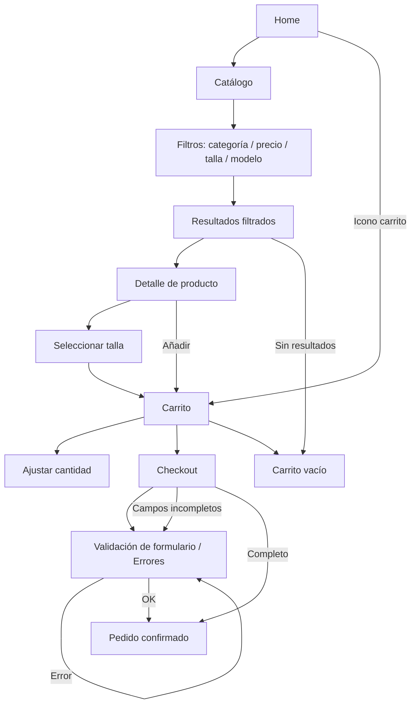

# Diagrama de flujo interactivo — ACROS

Este archivo contiene el flujo visual del prototipo. Puedes exportarlo como imagen desde un editor Mermaid o desde VS Code con una extensión compatible.

## Cómo usarlo
- Abre este archivo en VS Code con soporte Mermaid.
- Exporta como PNG/JPG si necesitas la imagen para los anexos.
- Si lo prefieres, copia el bloque Mermaid a un editor en línea como Mermaid Live Editor.
